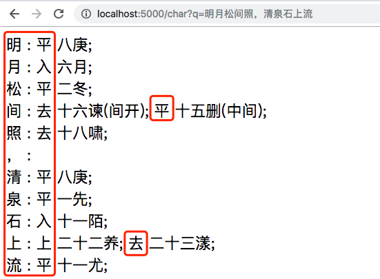
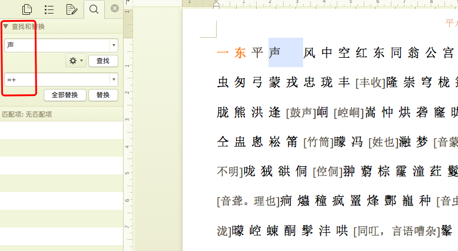
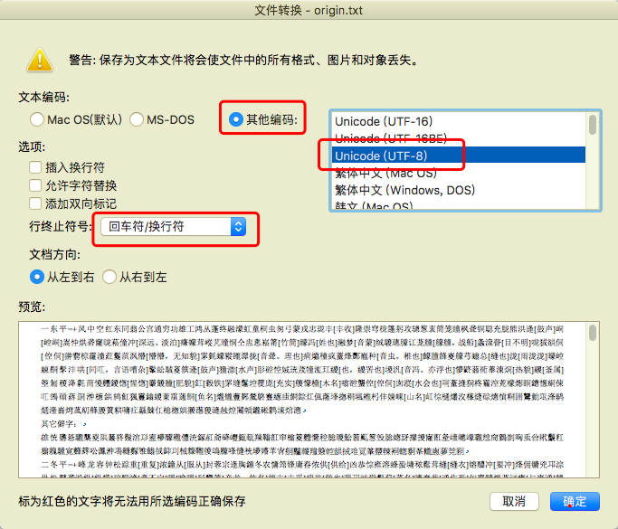

# 基于Python的平水韵查询工具

本工具基于原始的平水韵文档，生成JSON格式的韵文表，并通过Flask服务器提供查询韵部接口。

## 一、使用方法

支持两种方式查询韵部：

* 使用终端命令查询
* 使用浏览器查询

韵部查询涉及的2个脚本：

* yunServer.py	用于启动查询服务端口
* load.sh 启动脚本，操纵yunServer.py

韵部查询依赖**Python 3**和**Flask**包。

### 1.1 启停服务

```shell
# git clone https://github.com/Yixuan-Wang/pingShuiYun.git
# cd pingShuiYun

# ./load.sh
usage ./load.sh [start|stop|status]

# ./load.sh start
started...

# ./load.sh status
python yunServer.py data/baseCharDict.json
started...

# ./load.sh stop
stopped...
```

### 1.2 查询操作

终端查询：

```shell
# curl "http://localhost:5000/char?q=明月松间照，清泉石上流"
明 : 平 八庚; <br>
月 : 入 六月; <br>
松 : 平 二冬; <br>
间 : 去 十六谏(间开); 平 十五删(中间); <br>
照 : 去 十八啸; <br>
， : <br>
清 : 平 八庚; <br>
泉 : 平 一先; <br>
石 : 入 十一陌; <br>
上 : 上 二十二养; 去 二十三漾; <br>
流 : 平 十一尤; <br>


```


浏览器查询：




## 二、生成操作

### 2.1 原始文件

* 原始数据为Word文档，来源于搜韵网。
* 下载链接：https://sou-yun.com/QR.aspx
* 最新版本链接为[平水韵20170714.doc](https://sou-yun.com/%e5%b9%b3%e6%b0%b4%e9%9f%b5.doc)，data/平水韵20170714.doc是本地镜像文件。
* 相较原始数据修复了一处错误。


### 2.2 转换操作

对原文件做如下操作：

* 将原文件拷贝出复本。
* 复本：删除开头的说明。
* 复本：用Word替换每个韵部开头‘声 ’（声及后面的空白符）换为'=+'。方便Python处理。
* 拷贝复本：
  * 方法一：复制内容，在vi data/origin.txt文件中粘贴。
  * 方法二：Word中另存为方式：
    * 存储文件选择：**纯文本.txt**文件，并存储
    * 文本编码：**其他编码**，再选择：**Unicode(Utf-8)**
  * 两种方式仅少量生僻字有差异。


部分过程参考下图：

替换：



保存：




### 2.3 脚本生成JSON和YAML

生成YAML文件依赖**PyYAML**包。  
建议使用Python **3.6+** 以保证生成的字典保留原顺序。

#### 2.3.1 从文本文件生成查询用JSON
在 data/ 文件夹生成 baseCharDict.json, oriYunDict.json, categoricalDict.json。  
baseCharDict 按字头排列，是用于查询的字典；  
oriYunDict 按韵部排列，韵部内未切分各字头；  
categoricalDict 按韵部排列，韵部内按各字头分类，字头和解释未分开。

```shell
# python ./parseRaw.py data/origin.txt 1>gen.out 2>gen.err
```

在 baseCharDict 中每个字作为键，值是一个列表，因为一个字可能有多个读音，每个读音是一个列表的项。

```json
"临": [["去", "二十七沁", ""],   ["平", "十二侵", ""]],
"观": [["平", "十四寒", "观看"], ["上",  "15翰",  "楼观"]]
```


#### 2.3.2 从查询用JSON生成可读JSON

可以通过 genReadableJson.py 提高 baseCharDict 可读性，生成 baseIndent.json 方便人工查看。  
genReadableJson 也可以处理 parseRaw.py 生成的原始 oriYunDict 和 categoricalDict。

```shell
# python ./genReadableJson.py data/baseCharDict.json > data/baseIndent.json
```

#### 2.3.3 从查询用JSON生成YAML

可以通过 genYaml.py 对以上三个JSON文件进行操作，生成可读性更好的YAML文件。  
YAML格式下 baseCharDict 和 categoricalDict 可读性提高显著。  
依赖**PyYAML**包。

```shell
# python ./genYaml.py data/baseCharDict.json > data/baseCharYAML.json
```

#### 2.3.4 检查

检查一些常用字的平仄是否正常：

```shell
# python checkChar.py

# python checkChar.py data/baseCharDict.json  看 元
看
   去 十五翰
   平 十四寒
元
   平 十三元
```
## 三、鸣谢

本代码库基于 [jkak](https://github.com/jkak) 的 [pingShuiYun 代码库](https://github.com/jkak/pingShuiYun)和[搜韵网](https://sou-yun.com)的整理。